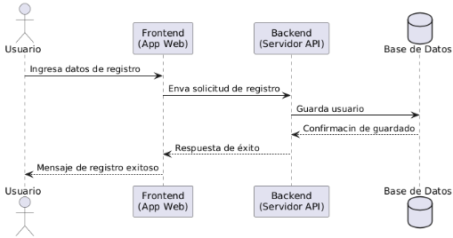

# Diagramas Arquitectura de Software
# Fit Match

---

# 3.1.1 Diagrama de Casos de Uso

---

# 3.2.1 Diagrama de Subsistemas (Paquetes)

---

# 3.2.2 Diagrama de Secuencia (Registro)

---

# 3.2.3 Diagrama de Colaboración (Match)

---

# 3.2.4 Diagrama de Objetos

---

# 3.2.5 Diagrama de Clases

---

# 3.2.6 Diagrama de Base de Datos (Relacional)

---

# 3.4.1 Diagrama de Procesos del Sistema (Actividad)

---

# 3.5.1 Diagrama de Despliegue

